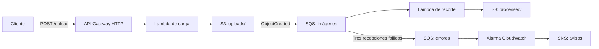

# Procesamiento de imágenes en AWS

Proyecto de Terraform que recibe imágenes mediante HTTPS, almacena los originales en Amazon S3 y genera recortes circulares transparentes de 40 × 40 píxeles con AWS Lambda. Una cola Amazon SQS desacopla la carga del procesamiento.

Repositorio: https://github.com/alexmisaellgonzalessoto/lab04awslambda

## Arquitectura



Cada entorno tiene una VPC `10.0.0.0/16`, dos subredes públicas y dos privadas distribuidas entre `us-east-1a` y `us-east-1b`. Las públicas usan una puerta de enlace de Internet; cada subred privada tiene una puerta NAT en su zona. Lambda accede a S3 por un punto de conexión de puerta de enlace y a SQS por un punto de conexión de interfaz con DNS privado. API Gateway, S3 y SQS son servicios administrados fuera de la VPC.

| Componente | Configuración |
| --- | --- |
| Subredes públicas | `10.0.1.0/24` y `10.0.2.0/24` |
| Subredes privadas | `10.0.11.0/24` y `10.0.12.0/24` |
| S3 | Acceso público bloqueado, versionado y cifrado AES256 |
| Originales y recortes | Prefijos `uploads/` y `processed/`; expiración a 30 y 90 días |
| Cola principal | Retención de un día, visibilidad de 360 segundos, espera larga de 20 segundos |
| Cola de errores | Retención de 14 días y redirección después de tres recepciones fallidas |
| Lambda de carga | Node.js 22, 256 MB, tiempo máximo de 30 segundos |
| Lambda de recorte | Node.js 22, 512 MB, tiempo máximo de 60 segundos, lote de cinco mensajes y fallos parciales |
| Registros | CloudWatch con retención de 14 días |
| Alarma | Mensajes visibles en la cola de errores mayores que cero; publicación en SNS |

Los roles IAM limitan las operaciones de imágenes a los prefijos correspondientes y el consumo de mensajes a la cola principal. Los grupos de seguridad de Lambda no tienen reglas de entrada. Los recursos usan las etiquetas `Project`, `Environment` y `ManagedBy`.

### Ajustes técnicos

La carga implementa la opción JSON con base64 del diagrama. Acepta PNG, JPEG, GIF y WebP de hasta **4 MiB** antes de codificar. El máximo de 10 MB del diagrama no cabe en una invocación síncrona de Lambda: AWS limita su solicitud a 6 MB y base64 aumenta el tamaño. El límite de la aplicación deja espacio para el evento de API Gateway. No se implementa carga mediante formularios multiparte.

Se utiliza Node.js 22 porque Node.js 20 alcanzó su fecha de obsolescencia el 30 de abril de 2026. Sharp está fijado en `0.35.5`; sus dependencias se preparan para Linux x64. Las dos funciones se configuran en ambas subredes privadas; AWS administra su ejecución entre zonas.

La API del laboratorio permite solicitudes sin autenticación y CORS desde cualquier origen. El tema SNS está preparado sin una suscripción de correo. Para recibir correos hay que agregar una suscripción y confirmar el enlace enviado por AWS.

## Requisitos

- Git, PowerShell, Node.js 22 o posterior y npm.
- Terraform `>= 1.15.0, < 2.0.0`.
- AWS CLI v2 con soporte de `aws login` y acceso a la cuenta de despliegue.
- Perfil local `lab04awslambda` y región `us-east-1`.
- Permisos para crear los recursos de red, IAM, S3, SQS, Lambda, API Gateway, CloudWatch y SNS.

El archivo `.terraform.lock.hcl` fija los proveedores comprobados: `hashicorp/aws` 6.67.0 y `hashicorp/archive` 2.8.1. Los paquetes, estados y credenciales están excluidos de Git.

## Clonar y configurar el perfil

Ejecutar los comandos desde PowerShell:

```powershell
git clone https://github.com/alexmisaellgonzalessoto/lab04awslambda.git
Set-Location lab04awslambda
aws login --profile lab04awslambda --region us-east-1
aws configure set region us-east-1 --profile lab04awslambda
aws sts get-caller-identity --profile lab04awslambda --region us-east-1
```

Completar el inicio de sesión en el navegador y comprobar que la identidad pertenece a la cuenta prevista. Terraform toma el perfil desde `var.perfil_aws`; las credenciales permanecen fuera del repositorio. Si la sesión caduca, repetir `aws login`. No compartir credenciales ni archivos de estado con los integrantes.

## Estructura del proyecto

- `entornos/`: valores de DEV, QA y PROD.
- `red.tf`, `red_publica.tf`, `red_privada.tf`: VPC, subredes, rutas, Internet y NAT.
- `almacenamiento.tf`, `colas.tf`, `notificaciones.tf`: almacenamiento y eventos de procesamiento.
- `conexiones_servicios.tf`, `permisos_funciones.tf`: conexiones privadas y permisos.
- `funcion_carga.tf`, `funcion_recorte.tf`, `api_carga.tf`, `alertas.tf`: funciones, API y alertas.
- `funciones/`: código de carga, recorte y preparación de dependencias.
- `ejemplos/`: imagen de prueba y comprobadores de carga, procesamiento y capacidad.
- `proveedores.tf`, `versiones.tf`, `variables.tf`, `identidad.tf`, `salidas.tf`: configuración y resultados de Terraform.

## Desplegar DEV, QA o PROD

Los tres entornos reutilizan el mismo código y tienen estados independientes mediante espacios de trabajo de Terraform. Sus nombres incluyen `dev`, `qa` o `prod`. La VPC exige que el espacio de trabajo coincida con la variable `entorno`, para evitar aplicar valores de otro entorno.

Preparar las dependencias e inicializar Terraform:

```powershell
& ./funciones/preparar-recorte.ps1
terraform init
terraform fmt -check -recursive
terraform validate
& ./ejemplos/verificar-capacidad.ps1 -DireccionesNuevas 2
```

Crear el espacio de trabajo en el primer despliegue. Este ejemplo utiliza DEV:

```powershell
terraform workspace new dev
terraform plan -var-file="entornos/dev.tfvars"
terraform apply -var-file="entornos/dev.tfvars"
```

Revisar el plan antes de confirmar `yes`. Para QA o PROD, sustituir `dev` por `qa` o `prod` tanto en el espacio de trabajo como en la ruta del archivo de variables. Si el espacio de trabajo ya existe, usar `terraform workspace select dev` en lugar de crearlo. Las comprobaciones de capacidad previas requieren dos direcciones nuevas únicamente cuando se van a crear las dos puertas NAT.

La arquitectura completa crea 64 recursos administrados por Terraform por entorno. Mantener los tres entornos requiere seis direcciones IP elásticas, además de las que ya utilicen otros proyectos de la cuenta. Consultar la cuota aplicada antes de solicitar un aumento.

## Probar la aplicación

Con el espacio de trabajo del entorno seleccionado:

```powershell
terraform workspace show
$direccionCarga = terraform output -raw url_carga
$almacenamiento = terraform output -json almacenamiento_imagenes | ConvertFrom-Json
& ./ejemplos/probar-carga.ps1 -Url $direccionCarga
New-Item -ItemType Directory -Force -Path "$env:TEMP/lab04awslambda-pruebas" | Out-Null
& ./ejemplos/verificar-procesamiento.ps1 -Url $direccionCarga -Bucket $almacenamiento.bucket -RutaRecorte "$env:TEMP/lab04awslambda-pruebas/recorte.png"
```

`probar-carga.ps1` envía `ejemplos/carga-imagen.json`. Una carga válida devuelve HTTP 202 con la clave del original. Esa respuesta confirma la recepción; el recorte aparece después del procesamiento asíncrono. El comprobador espera el objeto correspondiente en `processed/`, verifica PNG de 40 × 40 píxeles y cifrado AES256, y lo descarga.

Para enviar otra imagen, construir un JSON con `imagen_base64` y `tipo_contenido`. La aplicación devuelve 400 para datos inválidos, 415 para formatos no permitidos y 413 cuando la imagen supera su límite.

Después del despliegue:

```powershell
terraform plan -detailed-exitcode -var-file="entornos/dev.tfvars"
```

Usar el archivo del entorno seleccionado. El código de salida 0 significa que no hay diferencias; 2 indica cambios y 1 un error. DEV, QA y PROD fueron comprobados con carga y procesamiento reales. También se verificaron CORS, respuestas de validación y transparencia del recorte. La alarma de DEV publicó correctamente en SNS al detectar un mensaje visible en la cola de errores.

## Evidencias de entrega

El PDF de capturas debe mostrar la cuenta AWS, los recursos y pruebas de cada entorno, la URL del repositorio, los commits, las solicitudes de cambios de los integrantes y la eliminación de los recursos. No incluir claves de acceso ni tokens.

Conservar el estado local hasta completar la eliminación. Las capturas del despliegue no sustituyen la evidencia de `terraform destroy`. Adjuntar el PDF actualizado junto con el enlace del repositorio.

## Trabajo en equipo y solicitudes de cambios

Cada integrante debe realizar una contribución propia en una rama, crear su commit y abrir una solicitud de cambios con su cuenta de GitHub. Revisar e integrar cada propuesta y conservar su enlace como evidencia. No cambiar el autor de los commits para atribuir trabajo a otra persona.

Reparto sugerido para cinco integrantes:

| Integrante | Contribución concreta |
| --- | --- |
| Responsable de documentación | Instrucciones de despliegue, pruebas y eliminación |
| Responsable de API | Comprobador reproducible de JSON inválido, formato no admitido, límite de tamaño y CORS |
| Responsable de procesamiento | Comprobador reproducible de recortes, duplicados y fallos parciales |
| Responsable de red | Comprobador de subredes, rutas y puntos de conexión de cada entorno |
| Responsable de cierre | Comprobador de recursos restantes después de la eliminación |

Quien no tenga permiso de escritura puede crear una bifurcación del repositorio, trabajar en su rama y abrir una solicitud hacia `main` del repositorio original. Las propuestas deben aportar código o documentación verificables y explicar cómo se comprobaron.

```powershell
git switch -c pruebas/validacion-api
git status
git add ejemplos/verificar-api.ps1
git commit -m "test: comprueba las respuestas de la API"
git push -u origin pruebas/validacion-api
```

El ejemplo supone que el integrante ya escribió y validó ese archivo en su copia o bifurcación. En GitHub, crear la solicitud comparando su rama con `main` del repositorio original. No desplegar recursos adicionales para una contribución que solamente necesita comprobar código.

## Costos y eliminación

Las puertas NAT, las direcciones IPv4 públicas y los puntos de conexión de interfaz generan cargos mientras permanecen asignados. También pueden cobrarse almacenamiento, solicitudes y ejecuciones. La expiración de S3 a 30 o 90 días no elimina inmediatamente el laboratorio.

Eliminar únicamente el entorno seleccionado y repetir el procedimiento en el orden PROD, QA y DEV. Este ejemplo muestra PROD:

```powershell
terraform workspace select prod
terraform plan -destroy -var-file="entornos/prod.tfvars"
$almacenamiento = terraform output -json almacenamiento_imagenes | ConvertFrom-Json
aws s3api list-object-versions --bucket $almacenamiento.bucket --profile lab04awslambda --region us-east-1
```

Revisar el plan y guardar las evidencias antes de continuar. El bucket usa `force_destroy = false`: primero debe quedar vacío. En la consola S3, seleccionar **únicamente el bucket del entorno indicado por Terraform**, usar **Vaciar** y confirmar la eliminación de todas las versiones y marcadores de eliminación. Esto borra definitivamente las imágenes; hacerlo solo cuando esté autorizada la eliminación del entorno. No basta con borrar la versión actual de los objetos.

```powershell
terraform destroy -var-file="entornos/prod.tfvars"
terraform state list
aws s3api list-buckets --profile lab04awslambda --region us-east-1 --query "Buckets[?starts_with(Name, 'lab04awslambda-prod-')].Name"
aws ec2 describe-vpcs --profile lab04awslambda --region us-east-1 --filters Name=tag:Name,Values=lab04awslambda-prod-vpc --query 'Vpcs[].VpcId'
```

Confirmar manualmente `yes` después de revisar la lista. No usar aprobación automática. Al finalizar, el estado del entorno debe estar vacío y sus recursos deben haber desaparecido de la consola, incluidos NAT, direcciones IP, puntos de conexión, funciones, colas, API, registros, alarma y tema SNS. Comprobarlo y tomar capturas; no declarar la eliminación completada únicamente porque se inició el comando. Repetir con `qa` y `dev`. Eliminar el laboratorio detiene sus cargos futuros, pero no anula cargos ya acumulados.

## Fuentes oficiales

- [Inicio de sesión local y perfiles de AWS CLI](https://docs.aws.amazon.com/cli/latest/userguide/cli-configure-sign-in.html).
- [Cuotas de Lambda](https://docs.aws.amazon.com/lambda/latest/dg/gettingstarted-limits.html) y [versiones de ejecución](https://docs.aws.amazon.com/lambda/latest/dg/lambda-runtimes.html).
- [Lambda con SQS](https://docs.aws.amazon.com/lambda/latest/dg/with-sqs.html).
- [Conexiones de Lambda con una VPC](https://docs.aws.amazon.com/lambda/latest/dg/configuration-vpc.html).
- [Cuotas de Amazon VPC](https://docs.aws.amazon.com/vpc/latest/userguide/amazon-vpc-limits.html).
- [Vaciar un bucket S3](https://docs.aws.amazon.com/AmazonS3/latest/userguide/empty-bucket.html).
- [Proveedor oficial de AWS para Terraform](https://registry.terraform.io/providers/hashicorp/aws/latest/docs) y [espacios de trabajo](https://developer.hashicorp.com/terraform/cli/workspaces).
- [Solicitudes de cambios desde una bifurcación](https://docs.github.com/es/pull-requests/how-tos/create-pull-requests/creating-a-pull-request-from-a-fork).
